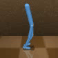
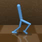
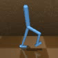
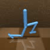
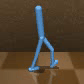

# A preliminary implementation of the use of Decion DiVerser to align different behavioral preferences

Generate behaviors with different speed preferences in the Mujoco-Walker2D.

velocity=1.0

velocity=0.8

velocity=0.6

velocity=0.4(something wrong?)

velocity=0.2

